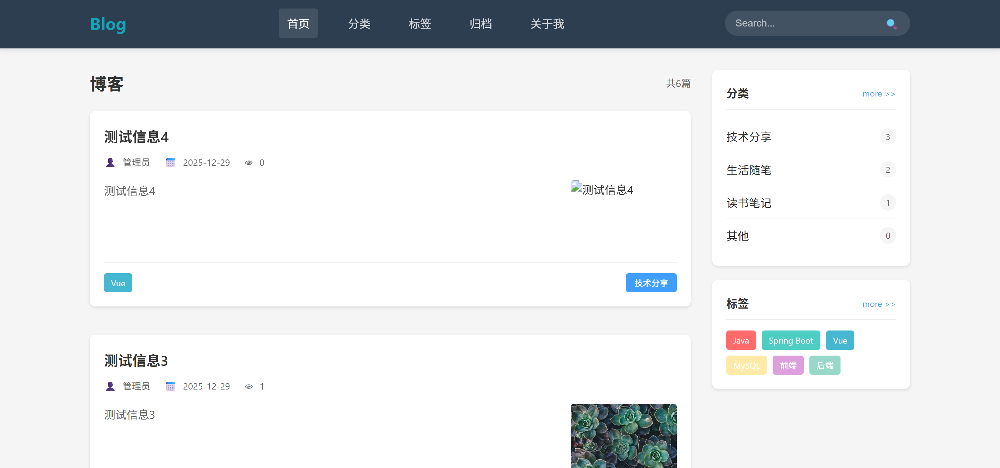
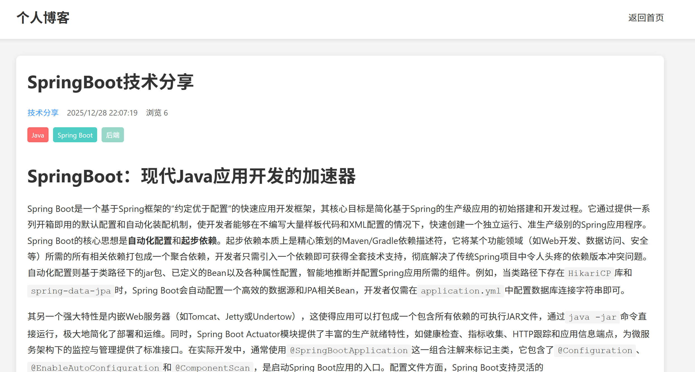
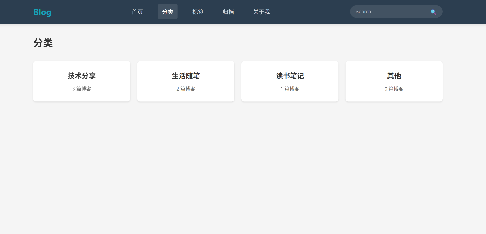
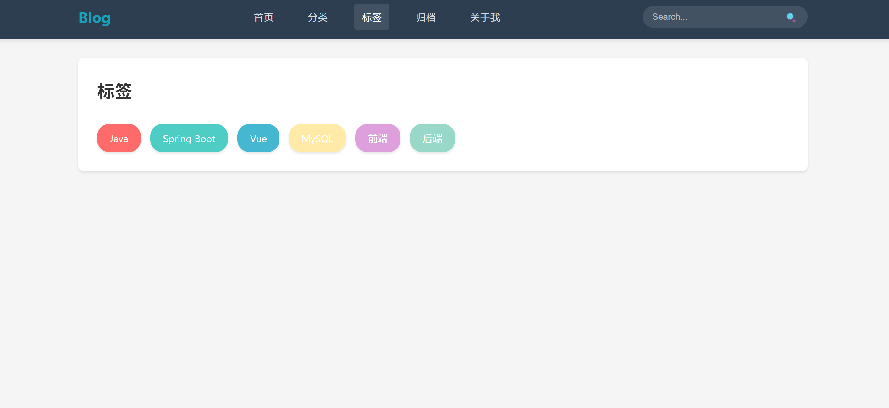
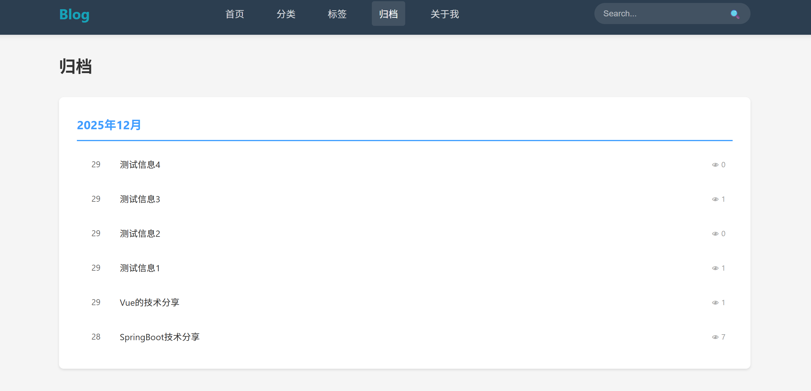
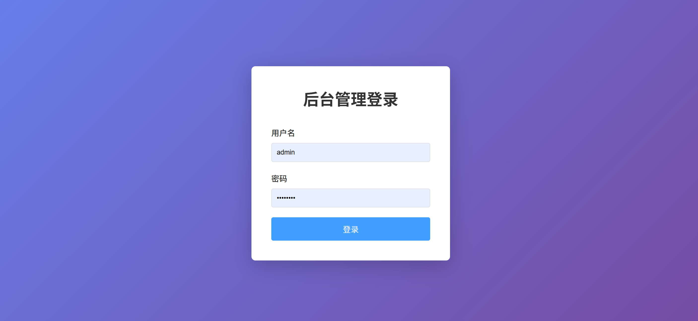
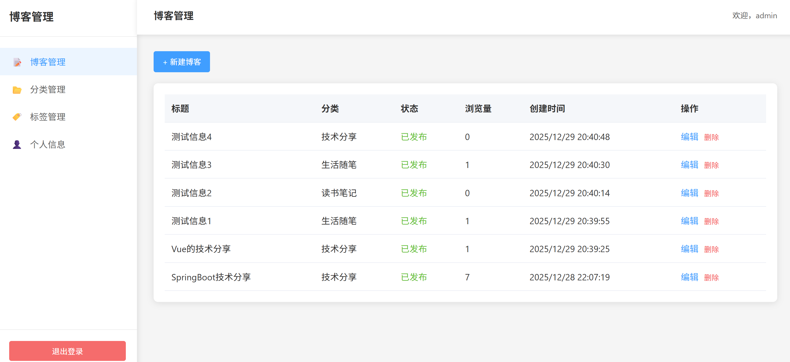
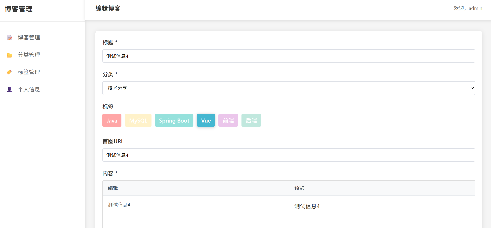
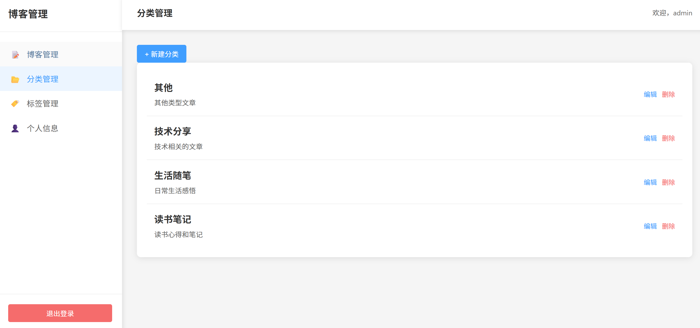
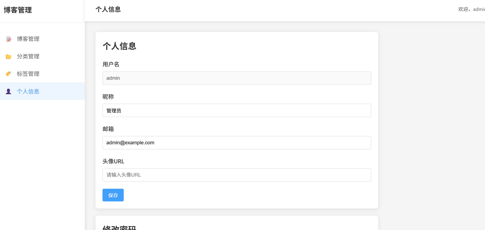

#  个人博客系统

一个基于 **Spring Boot 3** + **Vue 3** 的现代化个人博客系统，采用前后端分离架构，支持博客文章的展示、管理和编辑。系统支持 Markdown 格式、代码高亮、分类标签管理等功能。


---

##  功能特性

###  前台展示功能

#### 首页
- ✅ **博客列表展示** - 分页显示所有已发布的博客文章
- ✅ **实时搜索** - 支持标题、内容、分类、标签的模糊搜索
- ✅ **分类筛选** - 点击分类快速筛选对应博客
- ✅ **标签筛选** - 点击标签快速筛选对应博客
- ✅ **侧边栏导航** - 快速访问分类和标签
- ✅ **响应式设计** - 适配桌面和移动端

> 📸 **截图位置：首页展示**
> 
> <!-- 请在此处添加首页截图 -->
> 

#### 博客详情页
- ✅ **Markdown 渲染** - 完美支持 Markdown 语法
- ✅ **代码高亮** - 使用 Highlight.js 实现代码语法高亮
- ✅ **文章信息** - 显示作者、发布时间、浏览量等
- ✅ **标签展示** - 彩色标签展示，支持点击筛选
- ✅ **分类导航** - 快速跳转到对应分类

> 📸 **截图位置：博客详情页**
> 
> <!-- 请在此处添加博客详情页截图 -->
> 

#### 分类页面
- ✅ **分类列表** - 网格布局展示所有分类
- ✅ **博客统计** - 显示每个分类下的博客数量
- ✅ **快速筛选** - 点击分类跳转到首页并自动筛选

> 📸 **截图位置：分类页面**
> 
> <!-- 请在此处添加分类页面截图 -->
> 

#### 标签页面
- ✅ **标签云** - 彩色标签云展示
- ✅ **快速筛选** - 点击标签跳转到首页并自动筛选

> 📸 **截图位置：标签页面**
> 
> <!-- 请在此处添加标签页面截图 -->
> 

#### 归档页面
- ✅ **时间归档** - 按时间顺序展示所有博客
- ✅ **年份分组** - 按年份分组展示

> 📸 **截图位置：归档页面**
> 
> <!-- 请在此处添加归档页面截图 -->
> 


---

###  后台管理功能

#### 登录系统
- ✅ **Session 认证** - 安全的用户认证机制
- ✅ **密码加密** - BCrypt 密码加密存储
- ✅ **登录状态保持** - 支持会话保持

> 📸 **截图位置：登录页面**
> 
> <!-- 请在此处添加登录页面截图 -->
> 

#### 博客管理
- ✅ **博客列表** - 分页展示所有博客（包含草稿）
- ✅ **创建博客** - 支持 Markdown 编辑器
- ✅ **编辑博客** - 修改已有博客内容
- ✅ **删除博客** - 安全删除博客
- ✅ **发布状态** - 支持发布/草稿切换
- ✅ **分类关联** - 为博客设置分类
- ✅ **标签关联** - 为博客设置多个标签
- ✅ **首图设置** - 支持设置博客首图

> 📸 **截图位置：博客管理页面**
> 
> <!-- 请在此处添加博客管理页面截图 -->
> 

> 📸 **截图位置：博客编辑页面**
> 
> <!-- 请在此处添加博客编辑页面截图 -->
> 

#### 分类管理
- ✅ **分类列表** - 展示所有分类
- ✅ **创建分类** - 添加新分类
- ✅ **编辑分类** - 修改分类信息
- ✅ **删除分类** - 删除不需要的分类
- ✅ **用户隔离** - 每个用户只能管理自己的分类

> 📸 **截图位置：分类管理页面**
> 
> <!-- 请在此处添加分类管理页面截图 -->
> 

#### 标签管理
- ✅ **标签列表** - 展示所有标签
- ✅ **创建标签** - 添加新标签（支持设置颜色）
- ✅ **编辑标签** - 修改标签信息和颜色
- ✅ **删除标签** - 删除不需要的标签
- ✅ **用户隔离** - 每个用户只能管理自己的标签

> 📸 **截图位置：标签管理页面**
> 
> <!-- 请在此处添加标签管理页面截图 -->
> 

#### 个人信息管理
- ✅ **查看信息** - 查看个人基本信息
- ✅ **修改信息** - 更新昵称、头像等信息
- ✅ **修改密码** - 安全修改登录密码

> 📸 **截图位置：个人信息页面**
> 
> <!-- 请在此处添加个人信息页面截图 -->
> 


---

##  技术栈

### 后端技术

| 技术 | 版本 | 说明 |
|------|------|------|
| Spring Boot | 3.1.4 | Java 后端框架 |
| MyBatis | - | ORM 框架，数据库操作 |
| MySQL | 8.0+ | 关系型数据库 |
| Spring Security | - | 密码加密（BCrypt） |
| Maven | - | 项目构建工具 |

### 前端技术

| 技术 | 版本 | 说明 |
|------|------|------|
| Vue | 3.0 | 渐进式 JavaScript 框架 |
| Vue Router | 4.0 | 前端路由管理 |
| Axios | - | HTTP 请求库 |
| Vite | - | 前端构建工具 |
| Marked | - | Markdown 解析和渲染 |
| Highlight.js | - | 代码语法高亮 |

---

## 📁 项目结构

```
weixiBlog/
├── src/                          # 后端代码（Spring Boot）
│   └── main/
│       ├── java/
│       │   └── com/weixi/blog/
│       │       ├── BlogApplication.java    # 启动类
│       │       ├── controller/             # 控制器层
│       │       │   ├── ApiBlogController.java
│       │       │   ├── ApiTypeController.java
│       │       │   ├── ApiTagController.java
│       │       │   └── LoginController.java
│       │       ├── service/                # 服务层
│       │       │   └── impl/
│       │       ├── mapper/                 # 数据访问层
│       │       ├── entity/                 # 实体类
│       │       ├── vo/                     # 视图对象
│       │       └── dto/                    # 数据传输对象
│       └── resources/
│           ├── application.yml              # 配置文件
│           └── mapper/                     # MyBatis XML 映射文件
│               └── BlogMapper.xml
│
├── frontend/                      # 前端代码（Vue 3）
│   ├── src/
│   │   ├── views/                # 页面组件
│   │   │   ├── Home.vue          # 首页
│   │   │   ├── BlogDetail.vue    # 博客详情
│   │   │   ├── Types.vue         # 分类页面
│   │   │   ├── Tags.vue          # 标签页面
│   │   │   ├── Archive.vue       # 归档页面
│   │   │   ├── About.vue         # 关于我
│   │   │   └── admin/            # 后台管理页面
│   │   │       ├── Login.vue
│   │   │       ├── Dashboard.vue
│   │   │       ├── BlogList.vue
│   │   │       ├── BlogEdit.vue
│   │   │       ├── TypeList.vue
│   │   │       ├── TagList.vue
│   │   │       └── Profile.vue
│   │   ├── router/               # 路由配置
│   │   ├── api/                  # API 接口封装
│   │   └── App.vue               # 根组件
│   ├── vite.config.js            # Vite 配置
│   └── package.json              # 前端依赖
│
├── archive/                       # 已隔离的小程序代码
├── blog_db.sql                   # 数据库初始化脚本
├── pom.xml                       # Maven 配置
├── README.md                     # 项目说明（本文件）
├── DEVELOPMENT_GUIDE.md          # 开发指南
└── API_TEST_GUIDE.md             # API 测试指南
```

---

## 🚀 快速开始

### 环境要求

- **JDK**: 17 或更高版本
- **Node.js**: 16 或更高版本
- **MySQL**: 8.0 或更高版本
- **Maven**: 3.6 或更高版本（可选）

### 1. 克隆项目

```bash
git clone <repository-url>
cd weixiBlog
```

### 2. 数据库配置

#### 2.1 创建数据库

执行 `blog_db.sql` 脚本创建数据库和表结构：

```bash
mysql -u root -p < blog_db.sql
```

或者手动执行 SQL 脚本。

#### 2.2 配置数据库连接

编辑 `src/main/resources/application.yml`，修改数据库连接信息：

```yaml
spring:
  datasource:
    url: jdbc:mysql://localhost:3306/blog_db?useUnicode=true&characterEncoding=UTF-8&useSSL=false&serverTimezone=Asia/Shanghai
    username: root
    password: your_password  # 修改为你的 MySQL 密码
```

#### 2.3 默认管理员账号

- **用户名**: `admin`
- **密码**: `admin123`

> ⚠️ **安全提示**: 首次使用前，请使用 BCrypt 工具生成新密码的哈希值并更新数据库。

### 3. 启动后端服务

#### 方式一：IDE 运行（推荐）

1. 使用 IntelliJ IDEA 或 Eclipse 打开项目
2. 找到 `src/main/java/com/weixi/blog/BlogApplication.java`
3. 右键运行 `main` 方法

#### 方式二：Maven 命令

```bash
mvn spring-boot:run
```

#### 方式三：打包运行

```bash
mvn clean package
java -jar target/weixi-blog-1.0.0.jar
```

**验证后端启动成功：**
- 控制台输出：`Tomcat started on port(s): 8083`
- 访问：`http://localhost:8083/api/login/current`（会返回未登录信息，说明后端已启动）

### 4. 启动前端服务

```bash
# 进入前端目录
cd frontend

# 安装依赖（首次运行）
npm install

# 启动开发服务器
npm run dev
```

**验证前端启动成功：**
- 控制台显示：`Local: http://localhost:3000/`
- 浏览器访问：`http://localhost:3000/`

### 5. 访问应用

- **前台访问**: http://localhost:3000
- **后台管理**: http://localhost:3000/admin/login

---

## API 接口文档

### 前台接口（无需认证）

#### 博客相关

| 方法 | 路径 | 说明 | 参数 |
|------|------|------|------|
| GET | `/api/blog/list` | 获取博客列表 | `current`, `size`, `keyword`, `typeId`, `tagId` |
| GET | `/api/blog/{id}` | 获取博客详情 | `id` (路径参数) |

#### 分类相关

| 方法 | 路径 | 说明 |
|------|------|------|
| GET | `/api/type/list` | 获取分类列表 |

#### 标签相关

| 方法 | 路径 | 说明 |
|------|------|------|
| GET | `/api/tag/list` | 获取标签列表 |

### 后台接口（需要登录）

#### 认证相关

| 方法 | 路径 | 说明 | 请求体 |
|------|------|------|--------|
| POST | `/api/login/login` | 用户登录 | `username`, `password` |
| POST | `/api/login/logout` | 用户注销 | - |
| GET | `/api/login/current` | 获取当前用户 | - |

#### 用户相关

| 方法 | 路径 | 说明 | 请求体 |
|------|------|------|--------|
| GET | `/api/user/info` | 获取用户信息 | - |
| PUT | `/api/user/info` | 更新用户信息 | `nickname`, `avatar` |
| PUT | `/api/user/password` | 修改密码 | `oldPassword`, `newPassword` |

#### 博客管理

| 方法 | 路径 | 说明 | 请求体 |
|------|------|------|--------|
| GET | `/api/blog/admin/list` | 获取博客列表 | `current`, `size`, `keyword`, `typeId`, `tagId`, `published` |
| GET | `/api/blog/admin/{id}` | 获取博客详情 | - |
| POST | `/api/blog/save` | 创建博客 | `title`, `content`, `typeId`, `tagIds[]`, `firstPicture`, `published` |
| PUT | `/api/blog/{id}` | 更新博客 | 同上 |
| DELETE | `/api/blog/{id}` | 删除博客 | - |

#### 分类管理

| 方法 | 路径 | 说明 | 请求体 |
|------|------|------|--------|
| GET | `/api/type/admin/list` | 获取分类列表 | - |
| POST | `/api/type/save` | 创建分类 | `name`, `description` |
| PUT | `/api/type/{id}` | 更新分类 | 同上 |
| DELETE | `/api/type/{id}` | 删除分类 | - |

#### 标签管理

| 方法 | 路径 | 说明 | 请求体 |
|------|------|------|--------|
| GET | `/api/tag/admin/list` | 获取标签列表 | - |
| POST | `/api/tag/save` | 创建标签 | `name`, `color` |
| PUT | `/api/tag/{id}` | 更新标签 | 同上 |
| DELETE | `/api/tag/{id}` | 删除标签 | - |

> 📖 **详细 API 测试指南**: 查看 [API_TEST_GUIDE.md](./API_TEST_GUIDE.md)

---

## 数据库设计

### 数据表结构

| 表名 | 说明 | 主要字段 |
|------|------|----------|
| `t_user` | 用户表 | `id`, `username`, `password`, `nickname`, `avatar` |
| `t_blog` | 博客表 | `id`, `title`, `content`, `type_id`, `user_id`, `published`, `views`, `first_picture` |
| `t_type` | 分类表 | `id`, `name`, `description`, `user_id` |
| `t_tag` | 标签表 | `id`, `name`, `color`, `user_id` |
| `t_blog_tags` | 博客标签关联表 | `blog_id`, `tag_id` |

### 数据隔离

- 每个用户只能管理自己的博客、分类和标签
- 通过 `user_id` 字段实现数据隔离
- 前台展示所有已发布的博客（不区分用户）

### ER 关系图

```
t_user (1) ────< (N) t_blog
              │
              ├───< (N) t_type
              │
              └───< (N) t_tag

t_blog (N) ────< (N) t_tag (通过 t_blog_tags)
```

---

## 开发文档

### 主要文档

-  **[开发指南](./DEVELOPMENT_GUIDE.md)** - 详细的开发文档，包含：
  - 项目架构说明（前后端分离）
  - 启动顺序和操作流程
  - 前后端交互原理
  - 增删改查开发示例
  - 日常开发操作指南
  - 常见问题解答

-  **[API 测试指南](./API_TEST_GUIDE.md)** - API 接口测试文档，包含：
  - cURL 命令示例
  - Postman 测试流程
  - 测试场景清单
  - 常见问题解答

-  **[前后端分离说明](./FRONTEND_BACKEND_EXPLANATION.md)** - 架构说明文档

---

##  核心特性说明

### 前后端分离架构

- **前端**: Vue 3 + Vite，运行在 3000 端口
- **后端**: Spring Boot，运行在 8083 端口
- **通信**: 通过 HTTP API（JSON 格式）进行数据交换
- **代理**: 开发环境通过 Vite 代理转发 API 请求

### 用户认证机制

- **Session 认证**: 使用服务器端 Session 存储用户登录状态
- **密码加密**: BCrypt 算法加密存储密码
- **路由守卫**: 前端路由守卫保护后台管理页面

### 搜索功能

支持多字段模糊搜索：
- 博客标题
- 博客内容
- 分类名称
- 标签名称

### 筛选功能

- **分类筛选**: 点击分类显示该分类下的所有博客
- **标签筛选**: 点击标签显示包含该标签的所有博客
- **组合筛选**: 支持搜索关键词 + 分类/标签组合筛选

---


